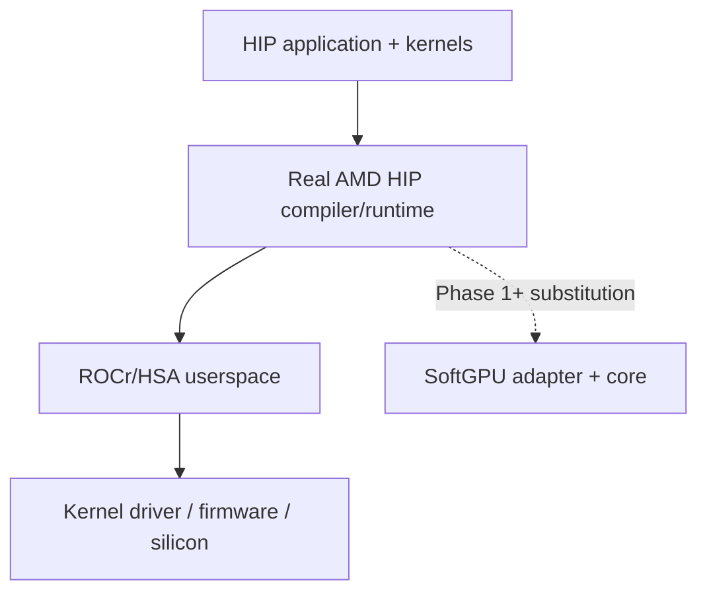

# Article 1 — Why build a developer-oriented virtual GPU?

- **Audience:** systems engineers and GPU runtime/compiler learners
- **Prerequisites:** basic CUDA/HIP mental model helpful but not required
- **Repository evidence tag:** Phase 0 (`cargo test --locked` on SoftGPU skeleton)
- **Access date:** 2026-09-13

## The problem

GPU stacks are excellent at running production kernels and terrible at explaining why a rare race, barrier mistake, or bad pointer only reproduces on one driver build. Developers bounce between:

| Approach | Strength | Gap |
| --- | --- | --- |
| Real GPU | Ground truth performance & many bugs | Opaque scheduling; weak sanitizers; CI cost/availability |
| CPU fallback / reference | Debuggable | Often different semantics; not the real dispatch path |
| Functional emulators | Repeatable results | Easy to over-claim ISA/hardware fidelity |
| Cycle-accurate / arch simulators | Timing research | Heavy; wrong tool for day-to-day correctness |
| Mocked APIs | Fast demos | Lies at the boundary applications actually use |

SoftGPU’s bet: a **truthful**, **fail-closed**, **sanitizer-first** virtual GPU that starts where real HIP userspace meets hardware-facing userspace libraries—not a toy HIP mock and not a PCIe device fantasy.

## Why this boundary



Mocking HIP would reinvent a moving target. Emulating PCIe/firmware would drown the project before the first useful diagnostic. Substituting ROCr/HSA (ADR-0001) keeps the official compiler path and focuses SoftGPU on agents, queues, packets, code objects, and execution semantics.

## SoftGPU product stance

1. **Evidence over vibes** — fidelity levels are named; unknown profile fields stay unknown.
2. **Fail closed** — unsupported behavior errors; it does not silently succeed.
3. **Sanitizers matter** — catching bounds/races/barriers is a first-class goal, not a side quest.
4. **Rust host, real HIP kernels** — host runtime in Rust; application kernels still come from the AMD HIP toolchain for compatibility gates.

## Reproducible example (Phase 0)

```bash
cargo test --locked
cargo run --locked -- validate-profile profiles/softgpu-generic-v0.json
cargo run --locked -- validate-profile profiles/amd-radeon-ai-pro-r9700-gfx1201-v0.json
```

The R9700 profile records `llvm_target=gfx1201` from ROCm documentation and leaves numeric limits **unknown**. That is intentional.

## What we verified / what remains assumed

| Verified now | Assumed / deferred |
| --- | --- |
| Skeleton builds/tests on pinned Rust 1.85 | ROCr substitution is loadable by real HIP (Phase 1) |
| Profile schema rejects conformance lies | Exact ROCm pin and symbol versions |
| Charter docs + ADR-0001 captured | Any kernel execution claim |

## Failure cases and unsupported semantics

- Enabling queues in Phase 0 config → `error[unsupported]`
- Invalid profile schema version → `error[profile]`
- No ROCr library, no dispatch, no ISA claims

## Security / portability

SoftGPU is a developer tool, not a sandbox. Apple Silicon is great for core Rust work; official ROCm integration belongs on Linux x86-64 CI. See `docs/threat-model.md`.

## References

- SoftGPU `docs/sources.md` (ROCm ROCR 7.14 docs, HSA Runtime 1.2, LLVM AMDGPUUsage)
- ADR-0001

## Lessons and next gate

Phase 0 teaches discipline: ship vocabulary and evidence hooks before ABI code. **Next gate:** Phase 1 load proof with pinned ROCm on Linux x86-64.
