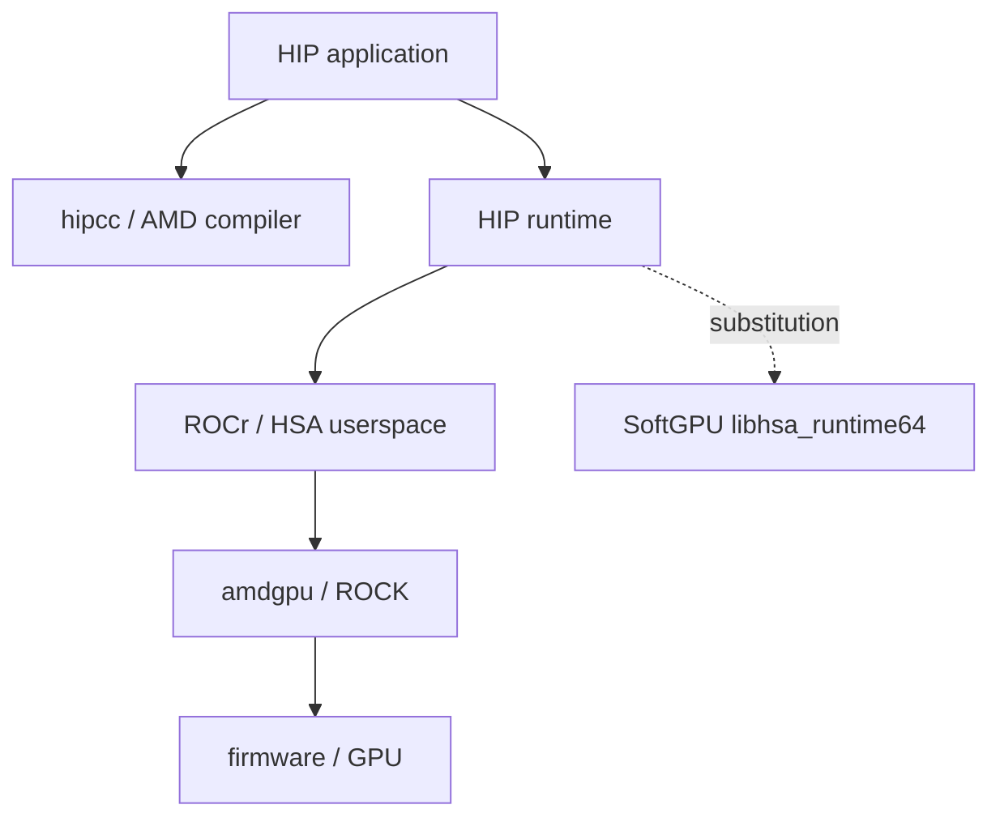

# Article 2 — The GPU software stack from HIP to silicon

- **Audience:** developers who know HIP/CUDA at API level
- **Prerequisites:** Article 1 / SoftGPU Phase 0 docs
- **Evidence:** SoftGPU `0.0.2` HSA adapter + layout probe
- **Access date:** 2026-09-13

## Problem

Applications talk HIP. Silicon speaks packets, memory fabrics, and firmware. SoftGPU must pick a substitution point that keeps the **real** HIP compiler/runtime while remaining a userspace developer tool.

## Layered view



SoftGPU starts at **ROCr/HSA**, not by mocking HIP and not by emulating PCIe (ADR-0001).

## What Phase 1/2 implements

| Piece | SoftGPU today |
| --- | --- |
| `hsa_init` / `hsa_shut_down` | Reference-counted session |
| `hsa_iterate_agents` / `hsa_agent_get_info` | One virtual GPU agent |
| Other `hsa_*` / AMD ext entry points | Fail-closed generated C stubs (load surface) |
| HIP-linked load proof | `environments/rocm-x86_64/run-phase1-load-proof.sh` on ROCm **7.14.0** |

## Reproducible commands

```bash
cargo test --workspace --locked
cc -I third_party/rocr-headers -o target/hsa-layout-probe tools/hsa-layout-probe/probe.c
./target/hsa-layout-probe

# Linux x86_64 + pinned ROCm image (CI):
bash environments/rocm-x86_64/ci-entrypoint.sh
```

## What we verified / what remains assumed

| Verified | Assumed / deferred |
| --- | --- |
| Layouts/enums vs vendored `hsa.h` | Live CI green on first push (image pull ~GB) |
| SoftGPU path wins over `/opt/rocm` in probe design + negative test | hipInit success / full HIP runtime semantics |
| Panic containment on Rust exports | Every AMD extension HIP might dlsym beyond stubs |

## Load-proof evidence contract

The HIP probe must print SoftGPU’s mapped `libhsa-runtime64` path via `dl_iterate_phdr` and **fail** if `/opt/rocm/.../libhsa-runtime64` is mapped. No kernel execution claim.

## References

- https://rocm.docs.amd.com/projects/ROCR-Runtime/en/docs-7.14.0/
- http://hsafoundation.com/wp-content/uploads/2021/02/HSA-Runtime-1.2.pdf
- SoftGPU `docs/sources.md`, ADR-0001, `environments/rocm-x86_64/PINNED`
