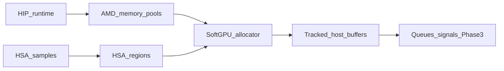

## Locked decision (Phase 3)

**Accepted: Path C — both minimal.** SoftGPU implements a small legacy region set and a small AMD pool set on one SoftGPU host allocator (`softgpu-software` provenance). See implementation in `softgpu-core` memory tables and HSA exports.

---

## What the Memory API decision is about

SoftGPU sits under HIP as a fake `libhsa-runtime64`. HIP (and other ROCm userspace) does not allocate GPU memory with `malloc` alone — it asks the HSA runtime for **named memory spaces** (“where can I allocate, with what properties?”) and then allocates from those spaces.

HSA has **two parallel discovery/allocation stories**:

| | Legacy HSA **regions** | AMD **memory pools** |
| --- | --- | --- |
| Header | `hsa.h` | `hsa_ext_amd.h` |
| Handle | `hsa_region_t` | `hsa_amd_memory_pool_t` |
| Enumerate | `hsa_agent_iterate_regions` | `hsa_amd_agent_iterate_memory_pools` |
| Query | `hsa_region_get_info` | `hsa_amd_memory_pool_get_info` |
| Allocate | `hsa_memory_allocate` / `hsa_memory_free` | `hsa_amd_memory_pool_allocate` / `hsa_amd_memory_pool_free` |
| Access model | regions + `hsa_memory_assign_agent` for coarse global | pools + `hsa_amd_agents_allow_access`, location CPU/GPU, etc. |

They describe similar ideas (global / fine vs coarse / kernarg / group / …) but are **different ABIs**. SoftGPU cannot “kind of support both” by accident — each path is a set of exports, handles, attributes, and fail-closed behavior.

---

## Path A — Legacy regions only

**What you’d implement:** one (or a few) `hsa_region_t`s on the SoftGPU GPU agent; `iterate_regions` / `region_get_info` / `memory_allocate` / `memory_free` (maybe `copy` / `register` later).

**Pros**
- Smaller core HSA surface; no AMD extension table yet.
- Matches textbooks / older HSA samples.
- Enough for SoftGPU-native tests and Article 4 pedagogy (“regions as contracts”).

**Cons for SoftGPU’s real goal**
- Modern **ROCm HIP** mostly walks **AMD pools**, not legacy regions.
- A HIP-linked probe after Phase 3 may still never call your region APIs, so you get little “HIP can allocate through SoftGPU” evidence.
- You still need pools later for a useful 0.2 / Phase 4–5 HIP path — so regions-only delays the HIP-relevant work.

**When it fits:** teaching HSA purity, or a temporary vertical slice with SoftGPU-only tests (not HIP).

---

## Path B — AMD memory pools only

**What you’d implement:** pools on the SoftGPU agent (typically fine-grained global, coarse global, kernarg-capable, maybe group/private as non-allocable info); `iterate_memory_pools` / `pool_get_info` / `pool_allocate` / `pool_free`, plus the minimal access helpers HIP actually touches.

**Pros**
- Aligns with **what HIP/ROCm actually call** after SoftGPU substitution.
- Stronger Phase 3 acceptance evidence: “HIP-linked process allocated via SoftGPU.”
- Matches SoftGPU’s ROCr-substitution story (ADR-0001): observe real userspace, implement that boundary.

**Cons**
- Larger AMD extension surface (more stubs to promote, more attributes, location flags).
- Pure HSA samples that only use regions still fail closed (honest, but incomplete for “full HSA”).
- Easy to over-claim if you invent pool sizes/limits without provenance (profiles must stay honest: unknown vs declared SoftGPU software limits).

**When it fits:** SoftGPU’s primary product path (HIP → SoftGPU).

---

## Path C — Both (minimal) — usually the right SoftGPU default

**What you’d implement (minimal, fail-closed):**

1. **Legacy:** one **global fine-grained** region (and optionally a kernarg-capable global region) that can allocate host-visible CPU buffers SoftGPU owns.
2. **AMD:** a small pool set that mirrors that story for HIP:
   - fine-grained global (CPU-located or “system” software memory),
   - coarse-grained global (optional, with honest ownership rules),
   - kernarg-capable fine pool if queue/dispatch prep needs it later.

Under the hood, both can back onto the **same SoftGPU allocator** (process heap / arena with SoftGPU tracking). Regions and pools are two **views** of the same software memory contract — not two hardware heaps.

**Pros**
- HIP path works; HSA-region path isn’t a hard lie.
- Matches “impersonate without lying”: advertise only what you implement; everything else stays stubs/`ERROR`.
- Phase 4 queues/AQL often need kernarg + fine global memory regardless of which discovery API HIP used to get there.

**Cons**
- More API surface and tests than A or B alone.
- Must keep attributes consistent (same size/granularity story on region vs pool) or diagnostics get confusing.
- Slightly more handle kinds / tables in `softgpu-core` (`Region` + `MemoryPool`).

---

## How this ties to SoftGPU honesty

Memory discovery is identity/capability advertising, like agent attributes:

- If you advertise a 16 GiB GPU VRAM pool with no evidence → **lying**.
- If you advertise a **SoftGPU software pool** with provenance `softgpu-software`, bounded size (e.g. configurable cap), fine-grained, CPU-backed → **honest ABI**.
- Numeric R9700 limits still `unknown` until measured — Phase 3 should **not** invent R9700 VRAM numbers.

So the decision is not “emulate a Radeon memory controller”; it’s “which **ABI door** does userspace open to get SoftGPU-owned buffers.”

---

## Practical impact on Phase 3 work

| Choice | SoftGPU tables | HIP evidence | Effort |
| --- | --- | --- | --- |
| Regions only | Region | Weak | Lower |
| Pools only | Pool | Strong | Medium |
| Both minimal | Region + Pool | Strong + broader | Medium–higher |

Signals and queues (the rest of Phase 3) need **some** allocatable fine memory for queue rings / kernarg eventually; pools-only or both both satisfy that. Regions-only can too for SoftGPU tests, but may not unlock HIP.

---

## Recommendation (for when you choose)

For SoftGPU’s stated goal (real HIP userspace → SoftGPU), prefer **both minimal** or at least **AMD pools**. Regions-only is the weakest fit for the ROCm integration story you already proved in Phases 1–2.

When you pick (e.g. “both minimal”), say so and we can lock the Phase 3 plan around that plus the separate `FEATURE`/queue decision.