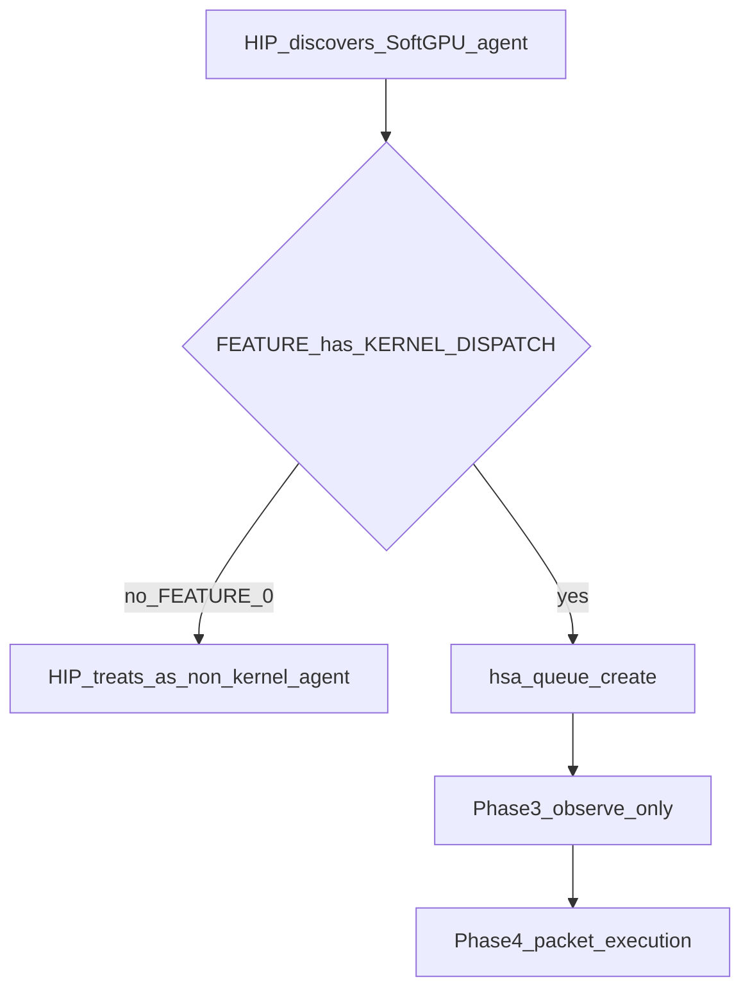

## Locked decision (Phase 3)

**Accepted: Option 3.** SoftGPU advertises `HSA_AGENT_FEATURE_KERNEL_DISPATCH`, implements queue create/destroy/indexes and doorbell observation, and does **not** execute AQL packets (Phase 4). Docs and probes state this honesty contract explicitly.

---

## What `FEATURE` means

`HSA_AGENT_INFO_FEATURE` is a bitfield on the agent. SoftGPU Phase 2 returns **`0`**.

From HSA:

- `HSA_AGENT_FEATURE_KERNEL_DISPATCH = 1` — agent supports **AQL kernel-dispatch packets** (it is a “kernel agent”).
- `HSA_AGENT_FEATURE_AGENT_DISPATCH = 2` — agent-dispatch packets.

That flag is **capability advertising**, not “queues exist.” It answers: *can this agent be treated as something you submit kernels to?*

SoftGPU’s honesty rule so far: **do not claim dispatch until you can back it.** That is why discovery works and `hipGetDeviceCount > 0` is **not** claimed ([docs/status.md](docs/status.md)).

---

## What queues are (Phase 3 intent)

A user-mode queue is a ring of AQL packets plus doorbell/indexes. Phase 3 charter usually means:

- create/destroy queue,
- allocate ring + doorbell signal,
- **observe** producer writes (indexes / packet headers),
- **not** execute packets (that is Phase 4+).

So Phase 3 can build **queue mechanics** without a real kernel engine.

---

## Why the two collide

HIP / ROCm typically:

1. Discover agents.
2. Read `FEATURE` (and related attrs).
3. If the agent looks like a kernel agent, create queues and go further.

So SoftGPU faces a consistency problem:

| SoftGPU says | SoftGPU does | Risk |
| --- | --- | --- |
| `FEATURE=0`, queues still stubbed | Fail closed on `hsa_queue_create` | Honest; HIP may never ask for queues |
| `FEATURE=0`, but SoftGPU implements `hsa_queue_create` | SoftGPU-native tests can create queues | Spec-odd: non–kernel-agent queues; HIP may still skip you |
| `FEATURE \|= KERNEL_DISPATCH`, queues work, packets not executed | HIP may create queues and later submit work | Stronger HIP progress; **over-claim** if HIP assumes “dispatch works” |
| `FEATURE \|= KERNEL_DISPATCH`, queues stubbed | Advertise dispatch, refuse queue create | Worst of both: lying then fail-closed |

The decision is which of those honesty/progress tradeoffs you accept for Phase 3.

---

## Option 1 — Keep `FEATURE=0`, defer queues to Phase 4

**Do in Phase 3:** memory (+ signals). Leave `hsa_queue_create` fail-closed.

**Pros**
- Matches Phase 2 story and tests (`FEATURE=0` must not claim dispatch).
- No premature “kernel agent” identity.
- Clear gate: turn on `KERNEL_DISPATCH` when execution (or a deliberate soft-queue story) exists.

**Cons**
- Phase 3 barely advances the HIP device path.
- Charter “queue mechanics” slips.

**Best if:** Phase 3 is memory-first; queues wait for a real dispatch story.

---

## Option 2 — Keep `FEATURE=0`, still implement SoftGPU queues

**Do:** `hsa_queue_create` / destroy / index APIs for SoftGPU probes and Article work; HIP may still ignore you as a kernel agent.

**Pros**
- You can test ring buffers, doorbells, signals without advertising dispatch.
- Avoids HIP suddenly treating SoftGPU as runnable GPU.

**Cons**
- Spec-wise awkward: queues usually belong with kernel agents.
- Weak HIP evidence (“queues exist but HIP never creates them”).
- Docs must say: SoftGPU queues are a **software observation surface**, not HIP device enablement.

**Best if:** you want queue plumbing for SoftGPU-native tests without changing HIP’s view of the agent.

---

## Option 3 — Set `KERNEL_DISPATCH`, implement queues, still no packet execution

**Do:** advertise `FEATURE |= KERNEL_DISPATCH`, implement create/destroy/observe; packet processor still no-ops or fail-closed on real dispatch.

**Pros**
- Likely unlocks HIP queue creation and “device-ish” progress after memory.
- Aligns Phase 3 charter (queues + observe) with what HIP expects from a GPU agent.
- Sets up Phase 4: execution behind an already-created queue.

**Cons**
- **Biggest honesty risk:** HIP may assume kernels can run; launches may fail later in opaque ways.
- You must document clearly: *kernel agent for queue ABI only; execution unsupported.*
- Tests that currently assert `FEATURE==0` must change; status/support matrix must update.

**Best if:** SoftGPU’s next evidence gate is “HIP created a SoftGPU queue,” knowing execution is still Phase 4.

---

## How this relates to Memory API (and why it is separate)

Memory APIs do **not** require `KERNEL_DISPATCH`. You can implement regions/pools with `FEATURE=0`.

Queues usually **do** interact with FEATURE for HIP. Signals sit in the middle (doorbells need signals whether or not FEATURE is set).

So the decisions stack as:

1. **Memory:** which ABI door (regions / pools / both).
2. **FEATURE vs queues:** whether SoftGPU becomes a kernel agent in Phase 3, and whether queue APIs land now.

---

## Practical recommendation

For SoftGPU’s HIP-substitution goal, the coherent Phase 3 choices are usually:

- **Memory:** both minimal (or pools-first).
- **FEATURE/queues:** either **Option 1** (memory-only Phase 3) or **Option 3** (advertise dispatch + queue observe, execution still Phase 4), with Option 3 only if you accept stronger docs/tests about “queue ABI ≠ runnable kernels.”

Option 2 is useful for SoftGPU-only pedagogy but often the least satisfying for ROCm CI evidence.

When you pick one (e.g. “Option 3” or “keep FEATURE=0, defer queues”), we can lock that into the Phase 3 plan next to the Memory API choice.